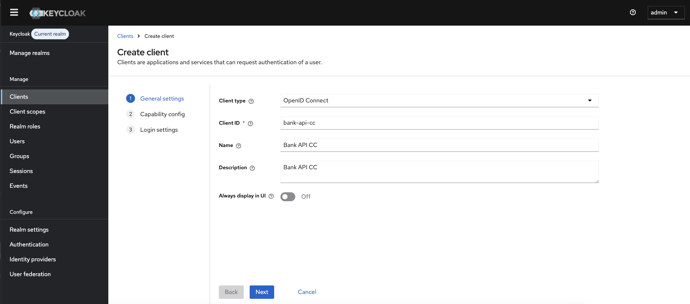
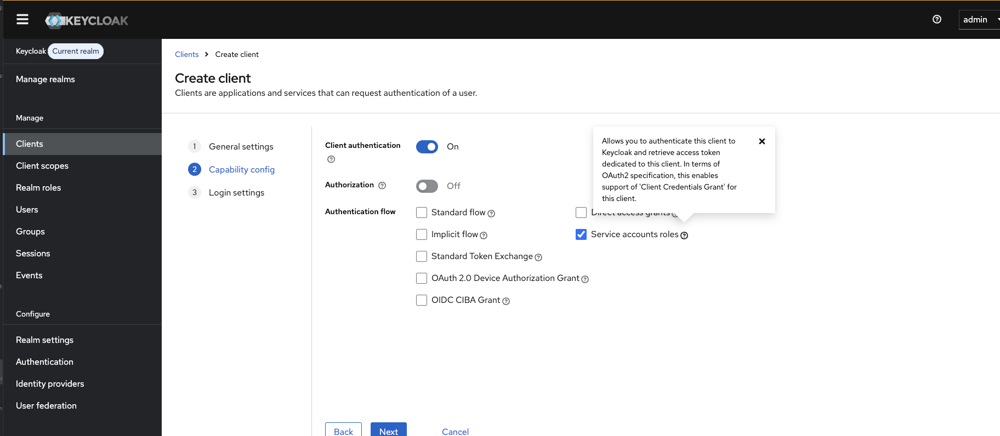
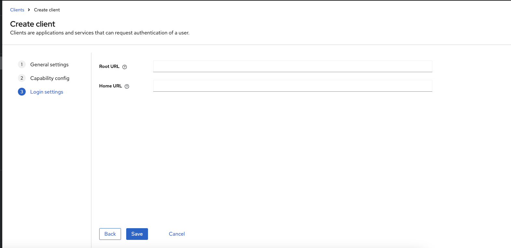
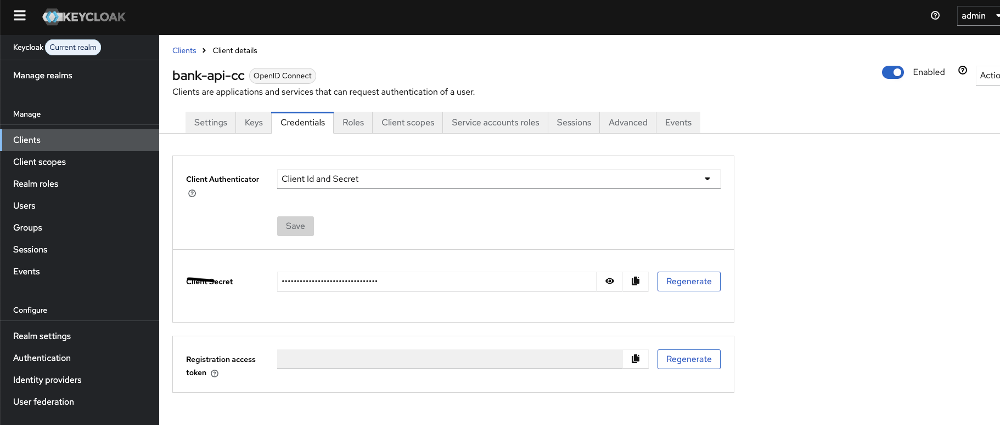
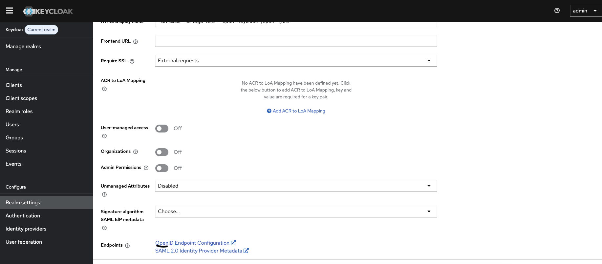

# Spring Cloud Gateway

## Overview

This repository implements **Spring Cloud Gateway**, a powerful and flexible API Gateway solution for routing requests to various backend services, including **Accounts**, **Transactions**, and **Cards** microservices. The gateway acts as a single entry point for all incoming requests, providing features such as routing, load balancing, and security.

**Spring Cloud Gateway** will route incoming API calls to the respective backend services using **Spring Cloud Discovery Client** for service registration and discovery. This approach ensures that your application is scalable, fault-tolerant, and secure.

## What is an API Gateway?

An **API Gateway** is an architectural pattern that acts as an entry point for clients to interact with backend microservices. It is responsible for request routing, load balancing, API composition, security, and monitoring. Instead of clients calling multiple services directly, all requests are routed through a single API Gateway, which then delegates the request to the appropriate service.

### Why is an API Gateway needed?

- **Single Entry Point**: Clients can interact with a single API Gateway instead of making multiple calls to different services.
- **Routing and Load Balancing**: API Gateway can route requests to appropriate services and provide load balancing across different instances of microservices.
- **Security**: It can act as a security layer, providing centralized authentication and authorization mechanisms.
- **Monitoring and Logging**: API Gateway can aggregate logs and metrics, making monitoring and debugging easier.
- **Cross-Cutting Concerns**: It handles common functionalities like rate limiting, request validation, and retry mechanisms, reducing the burden on each microservice.

## Architecture

In this implementation, the **Spring Cloud Gateway** will route requests to the following microservices:

- **Accounts Microservice**: Manages account-related operations.
- **Transaction Microservice**: Handles transaction-related operations.
- **Cards Microservice**: Deals with card-related operations.

The Spring Cloud Gateway uses **Spring Cloud Discovery Client** for internal service discovery, allowing dynamic resolution of service instances.

## Features of Spring Cloud Gateway

- **Routing**: Routes requests to various microservices based on predefined rules (e.g., URL path, headers, etc.).
- **Load Balancing**: Supports load balancing between multiple instances of services using Ribbon.
- **Filters**: Spring Cloud Gateway provides pre and post filters to modify request and response behaviors.
- **Rate Limiting**: Allows rate limiting for APIs to protect backend services.
- **Circuit Breaker**: Implements resilience patterns using circuit breakers.
- **Security**: Supports security mechanisms like OAuth2, JWT, etc., to secure endpoints.
- **Service Discovery**: Uses Spring Cloud Discovery Client to dynamically discover service instances.

## How It Works

### Request Flow

1. **Client Request**: A client sends an HTTP request to the Spring Cloud Gateway.
2. **Routing**: Based on the request, the gateway uses routing rules to forward the request to the appropriate microservice (Accounts, Transactions, or Cards).
3. **Service Discovery**: The gateway uses the Spring Cloud Discovery Client to find the correct instance of the microservice.
4. **Response**: After receiving the response from the backend microservice, the gateway returns the response to the client.

### Microservices Interaction

- **Accounts Microservice**: Responsible for operations related to user accounts.
- **Transaction Microservice**: Handles financial transactions.
- **Cards Microservice**: Manages card operations (e.g., card issuance, details).

The gateway will route requests to these services, but the internal communication between the gateway and the services will be done via the **Spring Cloud Discovery Client**.

## Security Setup with Spring Cloud Gateway and Keycloak
To implement security in our Spring Cloud Gateway server, we are using Spring Security along with Keycloak as the Identity and Access Management (IAM) tool.

### 🧰 Prerequisites
Docker installed on your machine

Basic understanding of Spring Cloud Gateway

Port 7080 should be available (for Keycloak UI)

### 🚀 Setting Up Keycloak with Docker
We will run Keycloak using Docker. You can find more information on their official site:
👉 Keycloak Docker Quickstart

Run the following command to start the Keycloak server in development mode:
```bash
docker run -p 7080:8080 \
  -e KC_BOOTSTRAP_ADMIN_USERNAME=admin \
  -e KC_BOOTSTRAP_ADMIN_PASSWORD=admin \
  quay.io/keycloak/keycloak:26.2.0 start-dev
```

Once the container is up and running, open your browser and visit:
http://localhost:7080

Log in using the following credentials:

- Username: admin
- Password: admin

### 🛠️ Realm and Client Configuration
After logging in, you'll land on the Keycloak admin console.

- 1. On the left navbar, select Realm.
- 2. You can create a new realm, or use the default master realm.
- 3. Next, go to Clients and click Create Client.

Fill in the following details:

Client Type: openid-connect
Client ID: for example, bank-api-cc
Name and Description as per your project needs
Save the client.






### use the below link to access the authentication token endpoint
http://localhost:7080/realms/master/.well-known/openid-configuration


### Request Body
```cURL
curl --location 'http://localhost:7080/realms/master/protocol/openid-connect/token' \
--header 'Content-Type: application/x-www-form-urlencoded' \
--header 'Cookie: JSESSIONID=26D83A9F71B3EBE8FB1176E220DF791D' \
--data-urlencode 'grant_type=client_credentials' \
--data-urlencode 'client_id=bank-api-cc' \
--data-urlencode 'client_secret=z68jEoq5mhWE4lWj5NGqz96vTJIWqw8i' \
--data-urlencode 'scope=openid email profile'
```

### Response Body
```json
{"access_token":"eyJhbGciOiJSUzI1NiIsInR5cCIgOiAiSldUIiwia2lkIiA6ICJSOW1ZbzBFSjV2SWtWbkstMzJxR0dTeTE4eTVXZ2Q4X19yVHpBckhLcEtvIn0.eyJleHAiOjE3NDU0MTI5NjksImlhdCI6MTc0NTQxMjkwOSwianRpIjoidHJydGNjOjcwZjU5MDIwLTA4MzgtNGE1MC04NDc0LWFiMWE5NzE4M2U4NSIsImlzcyI6Imh0dHA6Ly9sb2NhbGhvc3Q6NzA4MC9yZWFsbXMvbWFzdGVyIiwiYXVkIjoiYWNjb3VudCIsInN1YiI6ImU2M2MzODdjLTRmNDgtNGU1NC1iNTcwLWI4ZmI0Mzg4ZjFmNiIsInR5cCI6IkJlYXJlciIsImF6cCI6ImJhbmstYXBpLWNjIiwiYWNyIjoiMSIsImFsbG93ZWQtb3JpZ2lucyI6WyIvKiJdLCJyZWFsbV9hY2Nlc3MiOnsicm9sZXMiOlsiZGVmYXVsdC1yb2xlcy1tYXN0ZXIiLCJvZmZsaW5lX2FjY2VzcyIsInVtYV9hdXRob3JpemF0aW9uIl19LCJyZXNvdXJjZV9hY2Nlc3MiOnsiYWNjb3VudCI6eyJyb2xlcyI6WyJtYW5hZ2UtYWNjb3VudCIsIm1hbmFnZS1hY2NvdW50LWxpbmtzIiwidmlldy1wcm9maWxlIl19fSwic2NvcGUiOiJvcGVuaWQgZW1haWwgcHJvZmlsZSIsImNsaWVudEhvc3QiOiIxNzIuMTcuMC4xIiwiZW1haWxfdmVyaWZpZWQiOmZhbHNlLCJwcmVmZXJyZWRfdXNlcm5hbWUiOiJzZXJ2aWNlLWFjY291bnQtYmFuay1hcGktY2MiLCJjbGllbnRBZGRyZXNzIjoiMTcyLjE3LjAuMSIsImNsaWVudF9pZCI6ImJhbmstYXBpLWNjIn0.hBMlELhsJcTOxK5zQMgabdzAnuP6O1ZWzB4711ybYZpoIR5VedQmw1Dh2aOMuxmg5Y6L8RJs8WTLuwQB6WiLZS9hxC13TwqTmGah-23DyjbznFdE35limyZjsAN0JOJo2rNsArUcDVpTSekV08EKxMIynkdQX6iC2Evhx12_XnvHSo_ycIwzrJMSgjlMBqIgb1ZF2A3eqilzJc6XIlNeELI_HjhcpXf6lSYghO7j5KsvpfA-_phE_8_oOt16Dn2GPCyvw_qUmJ21PX_Luhi58ulVOFxxmIEWAlJT8ywKWGv_CAwGMCBwLZN-cSK6MlC6AT5-I8wlsqk_DTrjqdEWEw","expires_in":60,"refresh_expires_in":0,"token_type":"Bearer","id_token":"eyJhbGciOiJSUzI1NiIsInR5cCIgOiAiSldUIiwia2lkIiA6ICJSOW1ZbzBFSjV2SWtWbkstMzJxR0dTeTE4eTVXZ2Q4X19yVHpBckhLcEtvIn0.eyJleHAiOjE3NDU0MTI5NjksImlhdCI6MTc0NTQxMjkwOSwianRpIjoiNmJhYjEzMDctNmM2ZS00ZmUzLWIxMzUtOTJlNjg5OTg5M2U0IiwiaXNzIjoiaHR0cDovL2xvY2FsaG9zdDo3MDgwL3JlYWxtcy9tYXN0ZXIiLCJhdWQiOiJiYW5rLWFwaS1jYyIsInN1YiI6ImU2M2MzODdjLTRmNDgtNGU1NC1iNTcwLWI4ZmI0Mzg4ZjFmNiIsInR5cCI6IklEIiwiYXpwIjoiYmFuay1hcGktY2MiLCJhdF9oYXNoIjoiTnNWMFhfSkFzWnJzZkpDLUJIUl9KdyIsImFjciI6IjEiLCJjbGllbnRIb3N0IjoiMTcyLjE3LjAuMSIsImVtYWlsX3ZlcmlmaWVkIjpmYWxzZSwicHJlZmVycmVkX3VzZXJuYW1lIjoic2VydmljZS1hY2NvdW50LWJhbmstYXBpLWNjIiwiY2xpZW50QWRkcmVzcyI6IjE3Mi4xNy4wLjEiLCJjbGllbnRfaWQiOiJiYW5rLWFwaS1jYyJ9.IrwSSA3Ac2PE7Y7VVFSxaYwyIFgfod--z_W6mY0AHzhEWWTFsupWbQCj-A4Z3C4KtEAsfIIUYbwjRKsYAdoVQZa_hY4_tvpcJ1B9pewFXhrjhaaIpfs4FcbdePhfA_zvhnlEtJzaoqdrtZwZeHcr-hKtTOC33gHqpDkrTYACV-YlLLNXb-6OzZxuPSzKO0xt6ZMZCok1TZFgKVFlYdns9Zlv-f_qSaPMLMVl5w7wDa_4h1humLe6j5aMezGMWOqZc7i5JS6HqIb88N6jxkKikd59X3uzMA-eUzE2uVdL4rDVVtHhxj5od8HGTIVzNeZfox83ZBqqNfvUK8_YTZDK7w","not-before-policy":0,"scope":"openid email profile"}
```

💡 Note: We are using port 7080 to access the Keycloak admin GUI instead of the default 8080 to avoid conflicts.

