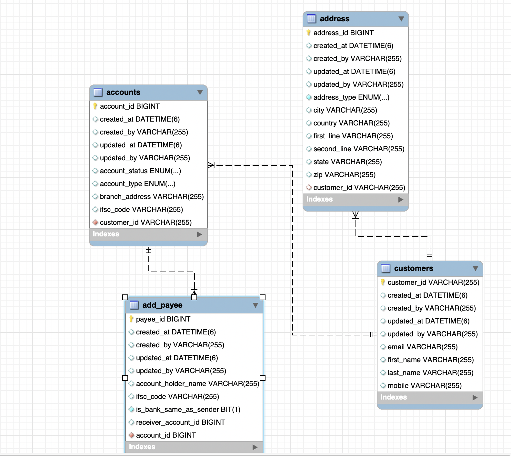

# Accounts Microservice - README

## 1. What is a Microservice?
Microservice architecture is a software development approach where a large application is divided into small, independently deployable services. Each service is responsible for a specific business function and communicates with other services over lightweight protocols like HTTP.

### Difference between Microservice, Monolithic, and SOA Architecture:
- **Monolithic Architecture:**
  - All components are combined into a single program and deployed together.
  - Difficult to scale and maintain over time.
  - A failure in one module can potentially bring down the entire application.

- **Service-Oriented Architecture (SOA):**
  - Components are separated into services, but often share enterprise-level infrastructure such as ESBs (Enterprise Service Bus).
  - More heavyweight and complex compared to microservices.

- **Microservices Architecture:**
  - Services are fine-grained, independently deployable, and loosely coupled.
  - Promotes continuous delivery and scalability.
  - Each service can use a different tech stack and database.

## 2. Advantages and Bottlenecks of Microservices

### Advantages:
- Independent deployment and scaling.
- Better fault isolation.
- Easier to understand, develop, and maintain.
- Enables continuous delivery and integration.
- Allows use of different technologies and databases per service.

### Bottlenecks:
- Increased complexity in service communication.
- Requires robust DevOps practices.
- Difficulties in managing distributed systems (e.g., debugging, tracing, consistency).
- Network latency and failures.
- Needs proper handling of inter-service security and data management.

## 3. Standards for REST API Design

To ensure consistency, reusability, and maintainability, the following standards should be followed while designing REST APIs in the `accounts-microservice`:

### a) Endpoint Definition:
- Use **nouns** to define endpoints, not verbs.
- Follow a hierarchical structure based on resources.

**Examples:**
```
GET /accounts/{accountId}
POST /accounts
PUT /accounts/{accountId}
DELETE /accounts/{accountId}
```

### b) Layered Architecture:
- **Controller Layer**: Responsible for handling HTTP requests and mapping them to appropriate service methods.
- **Service Layer**: Contains business logic, validation, and orchestration logic.
- **Repository Layer**: Handles interaction with the database using Spring Data JPA or MongoRepositories.

### c) Global Exception Handling:
Use `@ControllerAdvice` to manage exceptions centrally.

**Example:**
```java
@ResponseStatus(HttpStatus.NOT_FOUND)
@ExceptionHandler(AccountNotFoundException.class)
public ErrorResponse handleAccountNotFound(AccountNotFoundException ex) {
    return new ErrorResponse("ACCOUNT_NOT_FOUND", ex.getMessage());
}
```

### d) Input Validation:
Use `spring-boot-starter-validation` with annotations like `@NotBlank`, `@Size`, `@Pattern`, etc.

**Example Request DTO:**
```java
public class AccountRequest {
    @NotBlank(message = "Mobile number is mandatory")
    @Pattern(regexp = "^\\d{10}$", message = "Mobile number must be 10 digits")
    private String mobileNumber;

    @NotBlank(message = "Name is mandatory")
    private String name;
}
```

### e) Necessity of Documentation using OpenAPI Specification:
- **Standardization**: Provides a well-defined contract for API consumers.
- **Automation**: Helps generate client SDKs, API documentation, and server stubs automatically.
- **Discoverability**: Developers can explore API capabilities through tools like Swagger UI.
- **Consistency**: Ensures consistent documentation across services.
- **Validation**: Helps validate API requests and responses against defined schemas.

**Example OpenAPI Specification (YAML Format):**
```yaml
openapi: 3.0.0
info:
  title: Accounts Microservice API
  version: 1.0.0
tags:
  - name: Accounts
paths:
  /accounts:
    get:
      summary: Retrieve all accounts
      operationId: getAccounts
      responses:
        '200':
          description: Successfully retrieved accounts
```
In order to see the entire list of APIs, you can visit the [Swagger UI](http://localhost:8080/swagger-ui/index.html).

## 4. Database Entities
### Entity Relationship Diagram
Below is the ER diagram representing the relationships between **customers**, **accounts**, and **addresses**:



### Customers Table
Stores customer details.
```sql
CREATE TABLE customers (
    customer_id VARCHAR(255) PRIMARY KEY,
    created_at DATETIME(6),
    created_by VARCHAR(255),
    updated_at DATETIME(6),
    updated_by VARCHAR(255),
    email VARCHAR(255),
    first_name VARCHAR(255),
    last_name VARCHAR(255),
    mobile VARCHAR(255)
);
```

### Accounts Table
Stores account details linked to customers.
```sql
CREATE TABLE accounts (
    account_id BIGINT PRIMARY KEY,
    created_at DATETIME(6),
    created_by VARCHAR(255),
    updated_at DATETIME(6),
    updated_by VARCHAR(255),
    account_status ENUM(...),
    account_type ENUM(...),
    branch_address VARCHAR(255),
    ifsc_code VARCHAR(255),
    customer_id VARCHAR(255),
    FOREIGN KEY (customer_id) REFERENCES customers(customer_id)
);
```

### Address Table
Stores address details linked to customers.
```sql
CREATE TABLE address (
    address_id BIGINT PRIMARY KEY,
    created_at DATETIME(6),
    created_by VARCHAR(255),
    updated_at DATETIME(6),
    updated_by VARCHAR(255),
    address_type ENUM(...),
    city VARCHAR(255),
    country VARCHAR(255),
    first_line VARCHAR(255),
    second_line VARCHAR(255),
    state VARCHAR(255),
    zip VARCHAR(255),
    customer_id VARCHAR(255),
    FOREIGN KEY (customer_id) REFERENCES customers(customer_id)
);
```

### Entity Relationships
- One **customer** can have multiple **accounts**.
- One **customer** can have multiple **addresses**.

Further sections will include details on:
- Security
- Logging
- AOP
- Retry Mechanisms
- Fault Tolerance
- Caching
- Testing strategy
- Deployment strategy

_Stay tuned for more updates._

